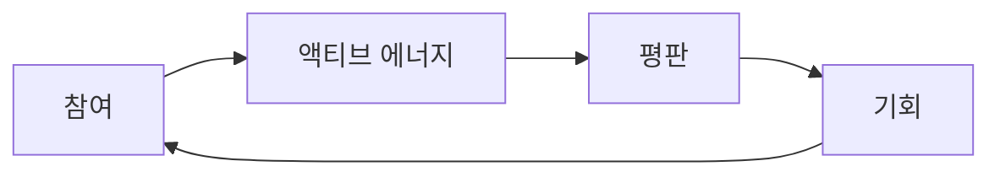

## RocX의 연료

모든 생태계에는 에너지가 필요합니다.

전통 금융은 자본으로 움직입니다. DeFi는 유동성으로 움직입니다. RocX는 참여로 움직입니다.

| 시스템 | 무엇으로 움직이는가 |
| --- | --- |
| 전통 금융 | 자본 |
| DeFi | 유동성 |
| RocX | 참여 |

우리는 이 에너지를 **액티브 에너지(Active Energy)** 라고 부릅니다.

액티브 에너지(AE)는 RocX 생태계를 움직이는 핵심 자원입니다. 단순한 포인트가 아닙니다. 일시적인 인센티브도 아닙니다. 그리고 투기를 보상하기 위해 설계된 것도 아닙니다.

액티브 에너지는 참여를 인정하기 위해 존재합니다.

RocX 내에서 이루어지는 모든 의미 있는 행동은 에너지를 생성합니다.

<CardGroup cols={2}>
  <Card title="자산 예치" icon="vault" />
  <Card title="미션 탐색" icon="compass" />
  <Card title="커뮤니티 참여" icon="users" />
  <Card title="지속적인 활동" icon="repeat" />
</CardGroup>

이러한 행동들은 액티브 에너지를 생성합니다. 참여는 사라지지 않고, 축적되어야 하기 때문입니다.

RocX에서 활동은 에너지가 됩니다. 그리고 에너지는 기회가 됩니다.

이것이 새로운 경제 순환을 만들어냅니다. 참여는 액티브 에너지를 생성합니다. 액티브 에너지는 평판을 만들어냅니다. 평판은 기회를 창출합니다. 그리고 기회는 더욱 적극적인 참여를 장려합니다.

이러한 순환은 사용자가 생태계 내에서 활동하는 한 계속됩니다. 그래서 우리는 이를 액티브 에너지라고 부릅니다.

액티브 에너지는 얻는 것이 아닙니다. 생태계를 살아있게 유지하는 원동력이기 때문입니다.

액티브 에너지는 보상이 아닙니다. 참여했다는 증거입니다.

<Note>
그리고 서바이벌 파이낸스에서는 참여가 중요합니다.
</Note>
