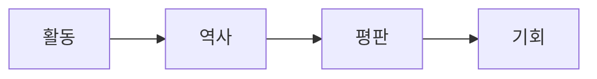

## 전통적인 대출 방식을 넘어

대출은 DeFi에서 가장 중요한 기본 요소 중 하나입니다. 대출을 통해 사용자는 유동성을 확보하고, 자본에 접근하고, 자산을 매도하지 않고도 금융 전략을 구축할 수 있습니다.

AAVE와 같은 프로토콜은 대출을 개방적이고 효율적인 금융 시장으로 변화시켰습니다. RocX는 이러한 기반 위에 구축되었습니다.

하지만 우리는 대출의 다음 진화는 단순히 자본에 관한 것이 아니라고 믿습니다. 바로 참여에 관한 것입니다.

우리는 이를 **활동 대출(Active Lending)** 이라고 부릅니다.

활동 대출은 금융 활동과 사용자 참여가 함께 성장하는 대출 시스템입니다. 사용자는 단순히 자산을 예치한다는 이유만으로 보상을 받는 것이 아닙니다. 사용자는 적극적으로 활동하고, 기회를 탐색하고, 생태계에 기여하고, 지속적으로 참여하는 것에 대해 인정받습니다.

이는 사용자와 프로토콜 간의 관계를 변화시킵니다.

전통적인 대출은 다음 요소에 중점을 둡니다. 액티브 렌딩은 이 모델을 확장하여 다음을 포함합니다.

| 전통적인 대출이 중점을 두는 것 | 액티브 렌딩이 더하는 것 |
| --- | --- |
| 예금 | 참여 |
| 차입 | 활동 |
| 이자율 | 평판 |
| 유동성 | 장기적인 참여 |

전통적인 DeFi에서는 자본이 주요 자산입니다. RocX에서는 자본은 시작일 뿐입니다.

활동이 역사를 만듭니다. 역사가 평판을 쌓습니다. 평판이 기회를 만듭니다.

이것이 바로 액티브 렌딩이 단순한 대출 메커니즘 이상인 이유입니다.

액티브 렌딩은 생존 금융의 핵심 동력입니다. 자본에 대한 보상뿐 아니라, 적극적으로 참여하고 지속적으로 함께하는 사람들을 인정하도록 설계된 시스템입니다.

금융의 미래는 자산을 소유한 사람들뿐만 아니라, 행동을 통해 가치를 창출하는 사람들에게도 달려 있기 때문입니다.
