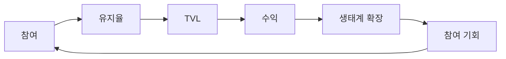

## 수익은 활동에서 시작됩니다

전통적인 금융 시스템은 거래를 통해 수익을 창출합니다. 대부분의 DeFi 프로토콜은 유동성을 통해 수익을 창출합니다.

하지만 RocX는 다른 곳에서 시작합니다. 수익은 참여에서 시작됩니다.

저희는 지속 가능한 성장이 단순히 자본 유치에만 의존할 수 없다고 믿습니다. 지속적인 성장은 계속해서 참여하고 기여하는 사용자로부터 시작되어야 합니다.

RocX에서 활동은 단발적인 행위가 아닙니다. 그것은 경제 순환의 시작점입니다.

참여는 유지율을 높입니다. 유지율은 TVL(총 예치금)을 증가시킵니다. TVL은 수익을 창출합니다. 수익은 생태계를 확장합니다. 그리고 확장은 더 많은 참여 기회를 창출합니다.

이것이 RocX의 성장 선순환 구조입니다.

수익은 자본에서 시작되지 않습니다. 참여에서 시작됩니다.

<Steps>
  <Step title="초기 수익 레이어" icon="building">
    RocX 수익의 첫 번째 계층은 핵심 금융 인프라를 기반으로 구축됩니다.

    - **대출 수익** — 프로토콜 내 대출 활동을 통해 발생하는 수익입니다.
    - **금고 수익** — 멀티볼트 전략 및 자산 활용을 통해 발생하는 수익입니다.

    이러한 수익원은 참여율과 총 예치 자산(TVL)이 증가함에 따라 자연스럽게 성장합니다.
  </Step>
  <Step title="확장 수익 레이어" icon="arrow-up-right-dots">
    생태계가 성장함에 따라 추가적인 수익원이 발생할 수 있습니다.

    - **청산 수익** — 생태계의 건전성을 유지하는 데 도움이 되는 청산 메커니즘을 통해 발생하는 수익입니다.
    - **생태계 수익** — 파트너십, 생태계 통합 및 향후 공동 개발 제품을 통해 발생하는 수익입니다.
  </Step>
  <Step title="미래 인프라 레이어" icon="layer-group">
    시간이 지남에 따라, RocX는 단순한 금융 프로토콜을 넘어 그 이상의 존재가 되는 것을 목표로 합니다.

    활동, 평판, 그리고 신원 정보는 온체인 인프라의 새로운 계층으로 발전할 수 있습니다. 이는 새로운 서비스, 새로운 통합, 그리고 새로운 형태의 가치 창출을 위한 기회를 만들어냅니다.
  </Step>
</Steps>

생태계의 건전성은 TVL(총 예치금)만으로 측정되는 것이 아닙니다. 생태계의 건전성은 얼마나 많은 사용자가 계속 참여하는지로 측정됩니다.

참여도가 높을수록 생태계는 더욱 강력해집니다. 그리고 생태계가 강력할수록 수익은 더욱 지속 가능해집니다.

이것이 바로 RocX가 거래를 중심으로 구축되지 않은 이유입니다.

<Note>
RocX는 사람을 중심으로 구축되었습니다. 수익은 활동에서 시작됩니다.
</Note>
