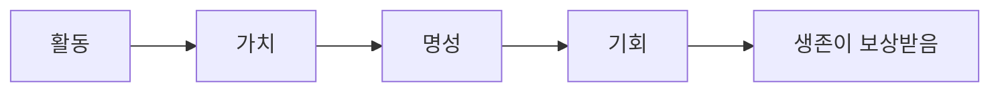

## 시작

금융의 미래는 하룻밤 사이에 만들어지지 않습니다.

가장 빠른 사람의 것도 아닙니다. 가장 목소리가 큰 사람의 것도 아닙니다. 먼저 도착하는 사람의 것도 아닙니다.

금융의 미래는 끊임없이 탐구하고, 기여하고, 머무르는 사람들의 것입니다.

진정한 가치는 한순간에 만들어지는 것이 아니기 때문입니다. 가치는 참여를 통해 구축되고, 신뢰를 통해 축적되며, 시간이 지남에 따라 강화됩니다.

RocX는 금융 시스템이 사람을 기억해야 한다고 믿습니다. 단순히 소유한 금액만이 아니라, 그들의 행동, 기여 방식, 그리고 얼마나 오래 머무르는가까지 말입니다.

이러한 믿음이 **생존 금융(Survival Finance)** 으로 이어졌습니다.

새로운 금융 영역인 생존 금융에서는 다음과 같은 원리가 적용됩니다.

활동이 가치가 되고, 가치가 명성을 쌓고, 명성이 기회를 창출하며, 생존이 보상받습니다.

미래는 하룻밤 사이에 만들어지지 않습니다. 미래는 머무르는 사람들에 의해 만들어집니다.

<Note>
투자하라. 탐험하라. 증명하라. 생존하라.

이것은 끝이 아니다. 이것은 단지 시작일 뿐이다.
</Note>
