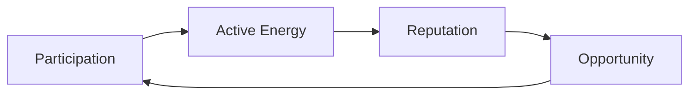

## The fuel of RocX

Every ecosystem needs energy.

Traditional finance runs on capital. DeFi runs on liquidity. RocX runs on participation.

| System | What it runs on |
| --- | --- |
| Traditional finance | Capital |
| DeFi | Liquidity |
| RocX | Participation |

We call this energy **Active Energy**.

Active Energy (AE) is the core resource that powers the RocX ecosystem. It is not just points. It is not a temporary incentive. And it is not designed to reward speculation.

Active Energy exists to recognize participation.

Every meaningful action within RocX generates energy.

<CardGroup cols={2}>
  <Card title="Deposit assets" icon="vault" />
  <Card title="Explore missions" icon="compass" />
  <Card title="Join the community" icon="users" />
  <Card title="Stay active" icon="repeat" />
</CardGroup>

These actions generate Active Energy. Because participation should not disappear, it should accumulate.

At RocX, activity becomes energy. And energy becomes opportunity.

This creates a new economic cycle. Participation generates Active Energy. Active Energy builds reputation. Reputation creates opportunity. And opportunity encourages even more participation.

This cycle continues as long as users stay active within the ecosystem. That is why we call it Active Energy.

Active Energy is not something you earn. It is the force that keeps the ecosystem alive.

Active Energy is not a reward. It is proof that you participated.

<Note>
And in Survival Finance, participation matters.
</Note>
