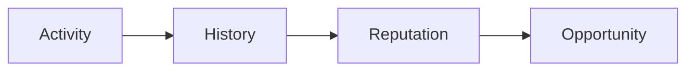

## Beyond traditional lending

Lending is one of the most important building blocks in DeFi. Through lending, users can secure liquidity, access capital, and build financial strategies without selling their assets.

Protocols like AAVE turned lending into an open and efficient financial market. RocX is built on this foundation.

But we believe the next evolution of lending is not simply about capital. It is about participation.

We call this **Active Lending**.

Active Lending is a lending system where financial activity and user participation grow together. Users are not rewarded simply for depositing assets. They are recognized for actively engaging, exploring opportunities, contributing to the ecosystem, and participating consistently.

This changes the relationship between users and the protocol.

Traditional lending focuses on the following elements. Active Lending extends this model to include the following.

| What traditional lending focuses on | What Active Lending adds |
| --- | --- |
| Deposits | Participation |
| Borrowing | Activity |
| Interest rates | Reputation |
| Liquidity | Long-term participation |

In traditional DeFi, capital is the main asset. At RocX, capital is only the beginning.

Activity builds history. History builds reputation. Reputation creates opportunity.

This is why Active Lending is more than just a lending mechanism.

Active Lending is the core engine of Survival Finance. It is a system designed to reward not only capital but also the people who actively participate and stay over time.

Because the future of finance depends not only on those who own assets but also on those who create value through their actions.
