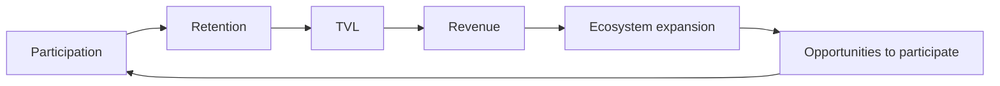

## Revenue begins with activity

Traditional financial systems generate revenue through transactions. Most DeFi protocols generate revenue through liquidity.

But RocX begins somewhere else. Revenue begins with participation.

We believe sustainable growth cannot depend on attracting capital alone. Lasting growth has to begin with users who keep participating and contributing.

At RocX, activity is not a one-time act. It is the starting point of an economic cycle.

Participation increases retention. Retention increases TVL. TVL generates revenue. Revenue expands the ecosystem. And expansion creates more opportunities to participate.

This is the virtuous growth cycle of RocX.

Revenue does not begin with capital. It begins with participation.

<Steps>
  <Step title="Initial revenue layer" icon="building">
    The first layer of RocX revenue is built on core financial infrastructure.

    **Lending revenue.** Revenue generated through lending activity within the protocol.

    **Vault revenue.** Revenue generated through multi-vault strategies and asset utilization.

    These revenue sources grow naturally as participation and TVL increase.
  </Step>
  <Step title="Expansion revenue layer" icon="arrow-up-right-dots">
    As the ecosystem grows, additional revenue sources may emerge.

    **Liquidation revenue.** Revenue generated through liquidation mechanisms that help maintain the health of the ecosystem.

    **Ecosystem revenue.** Revenue generated through partnerships, ecosystem integrations, and future co-developed products.
  </Step>
  <Step title="Future infrastructure layer" icon="layer-group">
    Over time, RocX aims to become more than just a financial protocol.

    Activity, reputation, and identity can grow into a new layer of on-chain infrastructure. This creates opportunities for new services, new integrations, and new forms of value creation.
  </Step>
</Steps>

The health of an ecosystem is not measured by TVL alone. It is measured by how many users keep participating.

The higher the participation, the stronger the ecosystem. And the stronger the ecosystem, the more sustainable the revenue.

This is why RocX is not built around transactions.

<Note>
RocX is built around people. Revenue begins with activity.
</Note>
