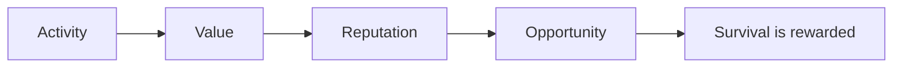

## The Beginning

The future of finance is not made overnight.

It does not belong to the fastest. It does not belong to the loudest. It does not belong to those who arrive first.

The future of finance belongs to those who keep exploring, contributing, and staying.

Because real value is not created in a single moment. Value is built through participation, accumulated through trust, and strengthened over time.

RocX believes a financial system should remember people. Not just the amount they own, but their actions, the way they contribute, and how long they stay.

This belief led to **Survival Finance**.

In Survival Finance, a new financial domain, the following principle applies.

Activity becomes value, value builds reputation, reputation creates opportunity, and survival is rewarded.

The future is not made overnight. The future is made by those who stay.

<Note>
Invest. Explore. Prove. Survive.

This is not the end. It is only the beginning.
</Note>
