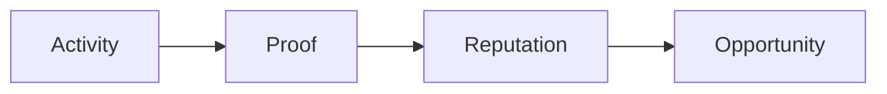

## Activity becomes value

For decades, financial systems have measured capital. The amount of money you own. The liquidity you provide. The collateral you deposit.

These metrics matter. But they are not enough. Because a person is more than capital.

Some people stay longer. Some contribute more. Some keep exploring, even when there is no immediate reward.

But today's financial systems barely recognize these actions.

Participation is invisible. Commitment goes unmeasured. And activity fades over time.

We believe this has to change.

At RocX, every meaningful action should leave a trace. Every deposit. Every task. Every contribution. Every day you keep showing up.

These actions are not temporary. They are proof.

<Note>
We call this **Proof of Activity**.
</Note>

Proof of Activity is a mechanism that turns participation into measurable on-chain value. It records not only what a user owns but also how they act.

Because in the future, financial opportunity should not depend on capital alone. It should also reflect participation, consistency, and trust.

Activity creates proof. Proof creates reputation. Reputation creates opportunity.

This is the foundation of Survival Finance. And this is where value begins.
