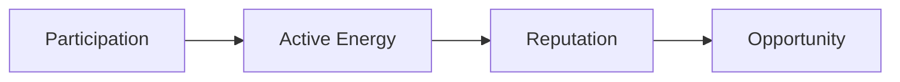

## Reputation becomes opportunity

Capital can move. Liquidity can leave. Markets can change.

**But reputation stays.**

RocX believes the future of finance will not be built on assets alone. It will be built on trust.

Trust is not made overnight. It is earned through participation, consistency, and meaningful action. Trust built up this way becomes **reputation**.

Reputation is more than a score. Reputation is a living history of who you are, how you participate, and what you contribute.

At RocX, every action leaves a trace. Every deposit, every exploration, every achievement, and every day you spend with us. These actions build your reputation.

Participation generates Active Energy. Active Energy builds reputation. And reputation creates opportunity.

The more you contribute, the more opportunity you gain.

The longer you stay, the stronger your identity becomes.

Reputation cannot be bought. It cannot be borrowed. And it cannot be transferred. It can only be earned.

This is why we believe reputation will become the most valuable asset in the next generation of on-chain finance.

<Note>
Wealth can be transferred, but reputation must be earned.
</Note>

This is the foundation of the RocX Reputation Layer. And this is how Survival Finance remembers its users.
