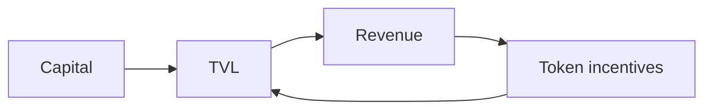
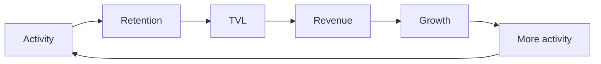

## A new value flywheel

Traditional DeFi changed finance forever. It opened up lending. It widened access to liquidity. And it made financial products available to anyone.

Protocols like AAVE laid the foundation for a new era of finance. RocX is built on this foundation.

But we believe the next generation of finance demands more.

Traditional DeFi focuses on optimizing capital. RocX focuses on optimizing participation. This difference changes everything.

Traditional DeFi focuses on the following elements. RocX extends this model through the following.

| What traditional DeFi focuses on | What RocX adds |
| --- | --- |
| Deposits | Activity |
| Borrowing | Active Energy |
| Liquidity | Reputation |
| Yield | Identity |
|  | Long-term participation |

### The traditional DeFi cycle

In traditional DeFi, value flows like this: Capital → TVL → Revenue → Token incentives → TVL.

Growth depends on attracting more liquidity.

But liquidity moves. Capital follows yield. Incentives expire. And users often leave.

### The RocX flywheel

At RocX, value flows like this: Activity → Retention → TVL → Revenue → Growth → More activity.

Growth begins with participation. Participation generates Active Energy. Active Energy builds reputation. Reputation strengthens identity. And identity encourages users to stay longer and participate more.

This creates a self-reinforcing cycle.

The flywheel grows not because users chase rewards, but because they build history. It grows not because capital flows in, but because people stay.

Traditional DeFi created financial freedom. RocX aims to create financial belonging.

<Note>
Because the future of finance is not about what users own. It is about who they become.
</Note>
