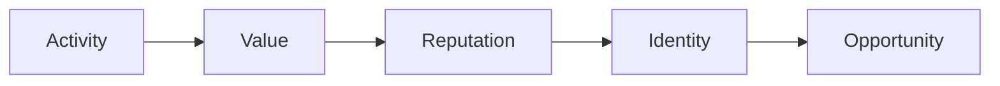

## More than just a protocol

RocX was not built to maximize TVL. It was built to maximize participation.

For years, DeFi has focused on liquidity. Protocols compete to attract more capital. Users wander in search of the next opportunity. This cycle brought growth, but it did not build lasting relationships.

RocX believes finance should be more human. People are not just liquidity providers. They are explorers, contributors, builders, and survivors. They participate, they create value, and they build trust over time.

This is why RocX is more than just a protocol.

RocX is an ecosystem where activity becomes value, value builds reputation, reputation forms identity, and identity opens opportunity. This creates a new virtuous cycle of value.

A system driven by participation, not speculation.

A system driven by long-term participation, not short-term profit.

A system that creates value rather than extracts it.

RocX is not trying to replace DeFi. It is building a new layer on top of DeFi.

A financial system where lasting participation matters. A financial system where participation matters. A financial system where trust matters.

Because we believe the future of finance belongs to those who explore, contribute, and stay.

<Note>
For those who stay. That is RocX.
</Note>
