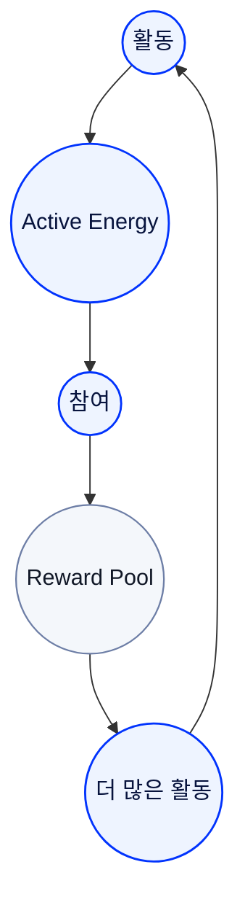

# 액티브 에너지 경제

## 활동 위에 세워지는 지속 가능한 경제

Active Energy는 얻는 것으로 끝나지 않습니다.

생성되고, 축적되고, 사용되고, 다시 생태계로 연결됩니다.

RocX는 활동이 지속 가능한 경제를 만들 수 있도록 Active Energy를 설계했습니다.

<Info>
활동은 에너지를 만들고,  
에너지는 생태계를 계속 움직입니다.
</Info>

---

## Active Energy는 순환합니다.

Active Energy는 한 번 지급되고 끝나는 보상이 아닙니다.

사용자의 활동을 통해 계속 생성되고, 생태계 안에서 지속적으로 순환합니다.

순환하는 구조이기 때문에 장기적인 참여가 더 큰 가치를 만들어냅니다.

---

## 지속 가능한 구조

RocX는 활동이 많아질수록 생태계도 함께 성장하도록 설계했습니다.

탐험 미션에서 발생하는 Active Energy 일부는 생태계로 다시 환원됩니다.

일부는 영구적으로 제거되어 균형을 유지하고, 일부는 Reward Pool로 돌아가 다음 참여자를 위한 새로운 활동을 지원합니다.

중요한 것은 숫자가 아니라 원리입니다.

---

## 활동은 다시 활동을 만듭니다.

Active Energy는 더 많은 참여를 만듭니다.

더 많은 참여는 다시 더 많은 활동으로 이어집니다.

이 순환 구조는 사용자와 생태계가 함께 성장하도록 설계되었습니다.

---

## 경제는 참여 위에서 성장합니다.

RocX는 자본만으로 성장하는 경제가 아니라, 참여가 함께 성장하는 경제를 만듭니다.

Active Energy는 그 중심에서 사용자와 생태계를 연결하는 공통 가치 단위입니다.

---

---

<Info>
건강한 경제는  
지속적인 참여 위에서  
만들어집니다.
</Info>

**Active Energy는 RocX 생태계를 계속 살아 움직이게 합니다.**
