```mermaid
flowchart LR
  A((1<br/>Use DeFi Planet)) --> B[Deposit<br/>Lending<br/>Financial Activity]
  B --> C[[Active Energy<br/>Accumulates]]

  C --> D((2<br/>Join Proof of Activity Planet))
  D --> E[Verify meaningful<br/>Web3 activities]
  E --> F[[Receive<br/>AE Boost]]

  F --> G((3<br/>Participate in<br/>Explore Planet))
  G --> H[Daily Proof of Activity<br/>Missions<br/>Campaigns]
  H --> I[[Additional<br/>Active Energy]]

  I --> J((4<br/>Grow Reputation))
  J --> K[Continuous<br/>participation]
  K --> L[[Long-term<br/>Trust]]

  L --> M((5<br/>Unlock Better<br/>DeFi Experience))
  M --> N[Higher Benefits<br/>Better Opportunities]
  N -.-> A

  classDef planet fill:#eef4ff,stroke:#0133FD,stroke-width:1.5px,color:#07133d;
  classDef action fill:#ffffff,stroke:#c9d4e8,stroke-width:1px,color:#111827;
  classDef value fill:#f4f7fb,stroke:#6d7ea6,stroke-width:1.2px,color:#111827;

  class A,D,G,J,M planet;
  class B,E,H,K,N action;
  class C,F,I,L value;
```

# 활동에서 혜택까지

## From Activity to Opportunity

RocX에서는 모든 활동이 하나의 흐름 안에서 금융 가치로 연결됩니다.

사용자는 활동을 수행하는 데서 멈추지 않고, 활동을 통해 더 나은 금융 경험을 만들어갑니다.

---

---

## 모든 활동은 하나로 연결됩니다.

RocX에서는 금융 활동, 활동 증명, 탐험 활동이 각각 따로 존재하지 않습니다.

세 개의 행성은 하나의 사용자 경험으로 연결됩니다.

사용자는 활동할수록 더 많은 Active Energy를 축적하고, 장기적인 Reputation을 만들며, DeFi Planet에서 더 많은 혜택을 받게 됩니다.

<Info>
DeFi creates value.  
Proof of Activity strengthens it.  
Explore keeps it growing.
</Info>

---

<Tip>
One ecosystem.  
One activity layer.  
One financial experience.
</Tip>

**Every Web3 Activity Creates Value.**