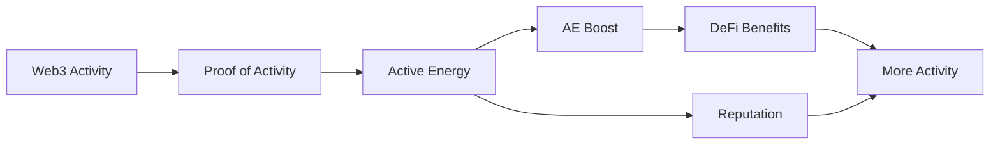

# 활동에서 혜택까지

Activity to Benefit Flow는 RocX의 핵심 작동 방식을 보여줍니다. 사용자의 Web3 활동은 검증, AE, 부스트를 거쳐 DeFi Planet 혜택과 Reputation으로 이어집니다.

## 전체 흐름

## Web3 Activity

출발점은 사용자의 의미 있는 Web3 활동입니다. DeFi 활동, 인증, 미션, 커뮤니티 참여 등은 모두 검증 가능한 신호가 될 수 있습니다.

## Proof of Activity

Proof of Activity는 활동을 확인하고 신뢰 가능한 형태로 정리합니다. 이 단계에서 활동은 흔어진 기록에서 RocX가 사용할 수 있는 신호로 바뀝니다.

## Active Energy와 AE Boost

검증된 활동은 Active Energy로 전환되고, 조건에 따라 AE Boost로 강화될 수 있습니다. 부스트는 DeFi Planet 혜택을 강화하기 위한 연결 장치입니다.

## DeFi Benefits와 Reputation

최종적으로 사용자는 DeFi Planet에서 더 좋은 조건과 기회를 경험할 수 있습니다. 동시에 활동과 AE는 Reputation으로 누적되어 장기적인 신뢰 기록을 만듭니다.