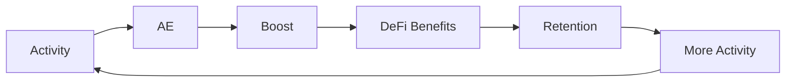

# 가치 플라이휠

Value Flywheel은 RocX의 성장 구조를 설명합니다. 활동이 AE와 혜택으로 연결되고, 그 혜택이 다시 더 많은 활동을 만드는 순환입니다.

## 순환 구조

## Activity에서 AE로

사용자의 의미 있는 활동은 Proof of Activity를 통해 AE로 연결됩니다. 이 단계에서 활동은 RocX 안에서 활용 가능한 가치 단위가 됩니다.

## AE에서 DeFi Benefits로

AE와 Boost는 DeFi Planet의 조건과 혜택을 강화합니다. 사용자는 활동이 실제 금융 경험에 영향을 준다는 것을 체감할 수 있습니다.

## Retention과 More Activity

더 나은 혜택은 사용자의 참여 유지로 이어질 수 있습니다. 참여가 이어질수록 더 많은 활동과 신뢰 기록이 만들어집니다.

## RocX의 성장 방향

RocX는 이 순환을 통해 사용자, 커뮤니티, DeFi Planet이 함께 성장하는 구조를 지향합니다. 핵심은 활동이 다시 금융 가치로 돌아오는 흐름입니다.