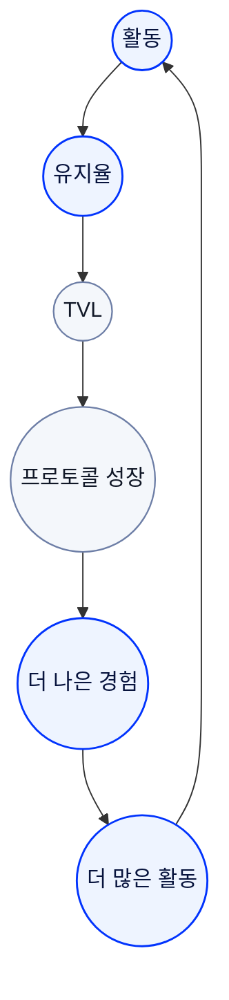

## 스스로 강화되는 성장

RocX는 사용자가 많아질수록 더 강해지는 플랫폼이 아닙니다.

사용자가 더 오래 참여할수록 더 강해지는 플랫폼입니다.

<Info>
지속 가능한 성장은  
일시적인 유인이 아니라  
참여에서 만들어집니다.
</Info>

---

---

## 활동이 유지율을 만듭니다.

지속적인 활동은 사용자가 더 오래 플랫폼을 이용하도록 만듭니다.

RocX는 유지율을 가장 중요한 성장 지표 중 하나로 봅니다.

---

## 유지율은 TVL을 강화합니다.

사용자가 계속 플랫폼에 머무를수록 금융 활동도 함께 증가합니다.

그 결과 TVL은 일시적인 유입이 아니라 지속적인 참여를 기반으로 성장합니다.

---

## 성장은 더 나은 경험을 만듭니다.

더 많은 활동과 더 강한 생태계는 더 나은 제품, 더 많은 파트너, 더 많은 기회를 만듭니다.

이 경험은 다시 더 많은 활동으로 이어집니다.

---

## 성장은 반복됩니다.

RocX는 한 번의 이벤트로 성장하지 않습니다.

사용자의 지속적인 참여가 생태계를 성장시키고, 성장한 생태계가 다시 더 많은 참여를 만드는 선순환 구조를 지향합니다.

---

<Info>
활동은 유지율을 만듭니다.  
유지율은 생태계를 강화합니다.  
생태계는 더 많은 활동을 만듭니다.
</Info>

**성장은 참여에서 시작됩니다.**
