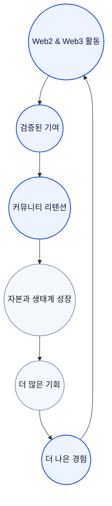

## 스스로 강화되는 성장

RocX는 더 많은 자본이나 사용자가 들어온다는 이유만으로 강해지지 않습니다.

온체인 자본 활동과 검증된 기여가 사용자의 지속적인 참여 이유를 만들 때 더 강해집니다.

그 결과 RocX는 일시적인 유인보다 인정, 평판, 유용한 경험, 새로운 기회를 통해 리텐션이 성장하는 활동 중심 블록체인 커뮤니티가 됩니다.

<Info>
지속 가능한 성장은  
일시적인 유인이 아니라  
참여에서 만들어집니다.
</Info>

---

```mermaid
flowchart TB
  A((Web2 & Web3 활동)) --> B((검증된 기여))
  B --> C((커뮤니티 리텐션))
  C --> D((자본과 생태계 성장))
  D --> E((더 많은 기회))
  E --> F((더 나은 경험))
  F --> A

  classDef flywheel fill:#eef4ff,stroke:#0133FD,stroke-width:1.5px,color:#07133d;
  classDef growth fill:#f4f7fb,stroke:#6d7ea6,stroke-width:1.2px,color:#111827;

  class A,B,C,F flywheel;
  class D,E growth;
```

---

## 검증된 활동이 커뮤니티 리텐션을 만듭니다.

사용자는 지갑, 프로토콜, 네이티브 Web3 환경 또는 익숙한 Web2 플랫폼에서 활동을 시작할 수 있습니다. 지원 가능한 기여가 검증되고 평판, 활동 정체성, 액티브 에너지, 생태계 경험과 연결되면 사용자는 다시 돌아와 참여할 이유를 갖게 됩니다.

RocX는 리텐션을 플랫폼 체류 시간만으로 판단하지 않고, 성장하는 블록체인 커뮤니티 안에서 반복되는 의미 있는 참여로 봅니다.

---

## 리텐션은 커뮤니티와 자본을 강화합니다.

다시 돌아오는 기여자는 생태계 지식, 기여자 인정, 파트너 발견, 금융 참여를 함께 확장합니다.

TVL과 프로토콜 활동도 일시적인 자본 유입만이 아니라 지속적인 커뮤니티 참여와 함께 성장할 수 있습니다.

---

## 연결된 커뮤니티는 새로운 기회를 만듭니다.

더 많은 유효 활동과 더 강한 Activity Graph는 더 나은 제품, 기여자 인정, 파트너 및 기회를 만듭니다.

이러한 기회는 RocX가 원본 플랫폼을 대체하지 않으면서도 익숙한 Web2 플랫폼의 사용자와 크리에이터를 Web3 생태계에 연결할 수 있게 합니다.

---

## 성장은 다시 참여로 돌아옵니다.

RocX는 한 번의 이벤트로 성장하지 않습니다.

사용자의 지속적인 참여가 생태계를 성장시키고, 성장한 생태계가 다시 더 많은 참여를 만드는 선순환 구조를 지향합니다.

---

<Info>
활동은 커뮤니티를 만듭니다.

커뮤니티는 리텐션을 강화합니다.

리텐션은 기회를 확장합니다.

기회는 더 많은 활동을 만듭니다.
</Info>

**성장은 참여에서 시작됩니다.**
