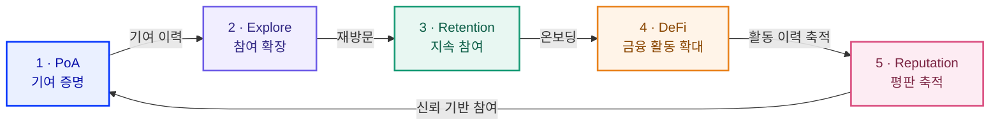

RocX는 온체인 자본 활동과 검증된 사용자 참여를 결합하는 **Proof of Activity 기반 DeFi 플랫폼**입니다.

RocX는 자본, 기여, 평판을 하나의 측정 가능한 가치 체계로 연결합니다. 자본은 금융 활동의 기반을 보여주고, 검증된 기여는 사용자가 Web3 생태계에 더한 가치를 드러내며, 평판은 그 품질과 지속성을 시간 위에 기록합니다.

이 연결 위에서 사용자, 기여자, 빌더, 파트너는 단발성 반응이나 보상을 넘어 시간에 따라 쌓인 활동과 기여 이력을 바탕으로 신뢰와 기회를 확장합니다.

RocX가 만드는 것은 참여의 흔적이 사라지지 않고 다음 활동과 협업으로 이어지는 **활동 중심 블록체인 생태계**입니다.

<Info>
자본은 사용자의 금융 활동을 보여줍니다.

기여는 사용자가 Web3에 더한 가치를 보여줍니다.

평판은 시간에 따라 쌓인 신뢰와 지속성을 기록합니다.
</Info>

---

## 참여가 DeFi를 강화하는 순환

RocX의 세 행성은 하나의 성장 루프로 연결됩니다. **PoA가 기여를 증명하고, Explore가 재방문을 만들며, 축적된 리텐션이 DeFi 활동 기반을 넓힙니다. 이 과정에서 쌓인 검증된 기여와 지속성은 평판으로 이어집니다.**

<Note>
평판은 자동 부여되는 보상이 아니라, 검증된 기여와 지속성 등 적격 신호가 누적된 기록입니다.
</Note>

---

## Web2의 도달 범위를 Web3 성장으로 연결하는 PoA

잠재적인 Web3 사용자의 상당수는 이미 Web2 플랫폼에서 콘텐츠를 만들고, 정보를 탐색하며, 커뮤니티에 참여하고 있습니다. RocX는 이들에게 새로운 활동 방식을 강요하는 대신, 기존 플랫폼에서 만든 의미 있는 활동을 PoA로 검증해 Web3 안에서 이어지는 기여 이력으로 전환합니다.

검증된 활동이 평판, 활동 정체성 및 참여 기회와 연결되면 일회성 유입은 축적되는 사용자 경험이 될 수 있습니다. 사용자는 자신의 기여가 기록되고 다음 활동에 반영되는 과정을 통해 다시 참여할 이유를 얻고, 생태계는 더 높은 리텐션을 바탕으로 지속적인 콘텐츠, 평가, 발견 및 커뮤니티 확장을 만들 수 있습니다.

이러한 지속 참여는 새로운 Web2 사용자가 RocX를 발견하는 접점을 늘리고, 기여 활동으로 시작한 사용자가 점진적으로 온체인 금융과 DeFi 행성으로 이동할 수 있는 경로를 만듭니다. RocX는 **Web2 유저 확보와 리텐션, 신규 Web2 유저 확충, 새로운 DeFi 유저 온보딩이 서로 강화되는 성장 구조**를 지향합니다.

<Info>
**Web2에서 발견 → PoA로 검증 → 기여 이력 축적 → 지속 참여와 리텐션 → 신규 Web2 유저 확충 → DeFi 온보딩**

각 단계의 평판, 참여 기회 및 DeFi 경험에는 별도의 자격 기준과 운영 정책이 적용됩니다.
</Info>

---

## 세 행성과 세 가지 역할

<CardGroup cols={3}>
  <Card title="DeFi 행성" icon="coins" href="/kr/whitepaper/defi-planet-overview">
    예치, 대출, 스왑, 브릿지 및 지원되는 온체인 금융 활동을 위한 **자본 레이어**입니다.
  </Card>
  <Card title="PoA 행성" icon="fingerprint" href="/kr/whitepaper/poa-planet-overview">
    의미 있는 활동을 등록하고 검증하며 평가하는 **참여와 기여 레이어**입니다.
  </Card>
  <Card title="Explore 행성" icon="compass" href="/kr/whitepaper/explore-planet-overview">
    액티브 에너지를 발견과 지속 참여에 연결할 수 있는 **참여 확장 레이어**입니다.
  </Card>
</CardGroup>

<Tip>
DeFi 행성은 자본을 측정합니다. PoA 행성은 기여를 측정합니다. Explore 행성은 참여가 계속 움직이게 합니다.
</Tip>

---

## 외부 기여가 가치 신호로 연결되는 방식

<Steps>
  <Step title="외부 플랫폼에서 기여를 만듭니다">
    사용자는 지원되는 플랫폼에서 리서치, 교육, 분석, 개발, 튜토리얼, 피드백과 같은 Web3 콘텐츠를 만듭니다.
  </Step>
  <Step title="원본 URL을 등록합니다">
    콘텐츠를 RocX에 다시 업로드하지 않고, 연결된 본인 계정에서 만든 원본 활동 링크만 등록합니다.
  </Step>
  <Step title="작성자와 활동을 검증합니다">
    RocX는 출처, 작성자 소유권, 중복 여부, Web3 관련성, 접근 가능성 및 정책 준수 여부를 확인할 수 있습니다.
  </Step>
  <Step title="적격 커뮤니티가 평가합니다">
    운영 기준을 충족한 사용자는 Helpful 또는 Not Helpful로 활동의 정보적·교육적·실용적 가치를 평가할 수 있습니다.
  </Step>
  <Step title="기여의 가치가 기록됩니다">
    유효한 결과는 적용되는 운영 정책과 검토를 거쳐 기여 점수, AE 배분 자격, 평판 및 활동 정체성의 신호가 될 수 있습니다.
  </Step>
</Steps>

<Note>
RocX는 콘텐츠가 만들어지는 플랫폼을 대체하거나 새로운 소셜 네트워크를 만들지 않습니다. 외부 활동을 검증하고 평가해 그 가치를 드러내는 레이어를 구축합니다.

활동 등록과 커뮤니티 평가에는 적격 DeFi 예치 기준을 비롯한 현재 운영 정책이 적용되며, 등록이나 검증만으로 AE 또는 평판이 보장되지 않습니다.
</Note>

---

## 크로스플랫폼 기여

Web3 기여는 RocX에 들어오기 전에 외부 플랫폼에서 만들어지는 경우가 많습니다. 사용자는 지원되는 리서치, 튜토리얼, 분석, 개발, 교육, 피드백, 커뮤니티 콘텐츠의 원본 URL을 등록할 수 있습니다.

콘텐츠는 만들어진 플랫폼에 남습니다. RocX는 PoA 행성 안에서 제목, 본문, 이미지, 영상, 첨부 파일 또는 썸네일을 직접 작성하거나 업로드하도록 요구하지 않습니다. 지원 가능하고 적절한 경우 원본 플랫폼에서 메타데이터를 가져올 수 있습니다.

<CardGroup cols={2}>
  <Card title="크로스플랫폼 활동 증명" icon="link" href="/kr/whitepaper/cross-platform-proof-of-activity">
    외부 Web3 기여가 RocX 가치 체계에 들어오는 방식을 확인합니다.
  </Card>
  <Card title="활동 등록과 검증" icon="shield-check" href="/kr/whitepaper/activity-registration-and-verification">
    출처, 작성자, 중복, 관련성, 유효성 및 어뷰징 검토를 확인합니다.
  </Card>
  <Card title="평가와 기여 점수" icon="scale-balanced" href="/kr/whitepaper/community-evaluation-and-contribution-score">
    Helpful, Not Helpful, 적격 평가 및 복합 신호 평가를 확인합니다.
  </Card>
  <Card title="PoA 활동 보드" icon="table-list" href="/kr/whitepaper/poa-activity-board">
    검증된 기여를 등록하고 탐색하는 제품 구조를 확인합니다.
  </Card>
</CardGroup>

---

## 하나의 활동 레이어와 여러 결과

DeFi는 RocX의 핵심 금융 레이어이지만 PoA 가치의 유일한 목적지는 아닙니다.

자격을 충족한 활동은 액티브 에너지, 평판, 활동 정체성, 기여자 인정, 파트너 기회, Explore 참여, 생태계 접근 및 더 나은 DeFi 경험으로 연결될 수 있습니다. 각 결과에는 서로 다른 자격 및 운영 정책이 적용됩니다.

<CardGroup cols={3}>
  <Card title="액티브 에너지" icon="zap" href="/kr/whitepaper/active-energy">
    활동과 참여에 사용되는 비양도형 오프체인 생태계 자원입니다.
  </Card>
  <Card title="평판" icon="badge-check" href="/kr/whitepaper/reputation-layer">
    장기적인 품질, 신뢰, 지속성 및 기여 이력을 나타내는 비양도형 기록입니다.
  </Card>
  <Card title="활동 정체성" icon="id-card" href="/kr/whitepaper/activity-identity">
    자본 활동, 검증된 기여, 적격 평가, 지속성 및 평판을 연결하는 가명 기반의 개인정보 보호 지향 기록입니다.
  </Card>
</CardGroup>

<Warning>
등록은 검증을 보장하지 않습니다. 검증은 액티브 에너지, 평판, 순위, 지급, 토큰 분배 또는 금융 수익을 보장하지 않습니다.
</Warning>
