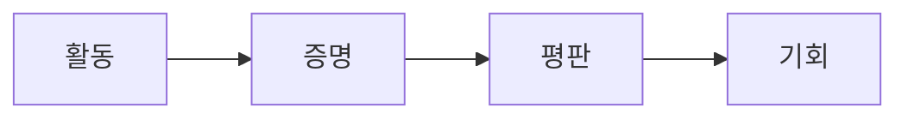

## 활동이 곧 가치가 된다

수십 년 동안, 금융 시스템은 자본을 측정해 왔습니다. 당신이 소유한 돈의 액수. 당신이 제공하는 유동성의 양. 당신이 예치한 담보의 양.

이러한 지표들은 중요합니다. 하지만 그것만으로는 충분하지 않습니다. 왜냐하면 사람은 자본 그 이상이기 때문입니다.

어떤 사람들은 더 오래 머무릅니다. 어떤 사람들은 더 많이 기여합니다. 어떤 사람들은 계속해서 탐구합니다. 비록 당장의 보상이 없더라도.

하지만 오늘날의 금융 시스템은 이러한 행동들을 거의 인식하지 못합니다.

참여는 보이지 않습니다. 헌신은 측정되지 않습니다. 그리고 활동은 시간이 지나면서 사라집니다.

우리는 이것이 바뀌어야 한다고 믿습니다.

RocX에서는, 모든 의미 있는 행동은 흔적을 남겨야 합니다. 모든 예금. 모든 임무. 모든 기여. 당신이 계속해서 함께하는 모든 날들.

이러한 행동들은 일시적인 것이 아닙니다. 그것들은 증거입니다.

<Note>
우리는 이것을 **활동 증명(Proof of Activity)** 이라고 부릅니다.
</Note>

활동 증명(Proof of Activity)은 참여를 측정 가능한 온체인 가치로 변환하는 메커니즘입니다. 이는 사용자가 무엇을 소유하고 있는지뿐만 아니라 어떻게 행동하는지도 기록합니다.

미래에는 금융 기회가 단순히 자본에만 의존해서는 안 되기 때문입니다. 참여, 일관성, 그리고 신뢰도 반영해야 합니다.

활동은 증명을 만듭니다. 증명은 평판을 만듭니다. 평판은 기회를 만듭니다.

이것이 서바이벌 파이낸스의 기반입니다. 그리고 이것이 바로 가치가 시작되는 곳입니다.
