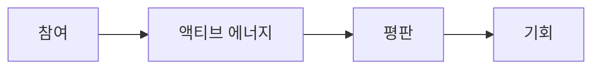

## 평판은 기회가 된다

자본은 이동할 수 있습니다. 유동성은 빠져나갈 수 있습니다. 시장은 변할 수 있습니다.

**하지만 평판은 남습니다.**

RocX는 금융의 미래가 단지 자산 위에 세워지는 것이 아니라고 믿습니다. 금융의 미래는 신뢰 위에 세워질 것입니다.

신뢰는 하루아침에 만들어지는 것이 아닙니다. 참여, 꾸준함, 그리고 의미 있는 행동을 통해 얻어지는 것입니다. 이렇게 축적된 신뢰가 **평판**이 됩니다.

평판은 단순한 점수 그 이상입니다. 평판은 당신이 누구인지, 어떻게 참여하는지, 그리고 무엇을 기여하는지에 대한 살아있는 역사입니다.

RocX에서는 모든 행동이 흔적을 남깁니다. 모든 예금, 모든 탐험, 모든 성과, 그리고 당신이 함께하는 매일매일이 그렇습니다. 이러한 행동들이 당신의 평판을 쌓아갑니다.

참여는 액티브 에너지를 만들어냅니다. 액티브 에너지는 평판을 만들어냅니다. 그리고 평판은 기회를 만들어냅니다.

더 많이 기여할수록, 더 많은 기회를 얻게 됩니다.

오래 머무를수록 당신의 정체성은 더욱 강해집니다.

평판은 돈으로 살 수 없습니다. 빌릴 수도 없습니다. 그리고 양도할 수도 없습니다. 오직 얻어야만 합니다.

바로 이 때문에 저희는 평판이 차세대 온체인 금융에서 가장 가치 있는 자산이 될 것이라고 믿습니다.

<Note>
부(富)는 양도할 수 있지만, 평판을 얻어야만 합니다.
</Note>

이것이 바로 RocX 평판 레이어의 기반입니다. 그리고 이것이 바로 Survival Finance가 사용자를 기억하는 방식입니다.
