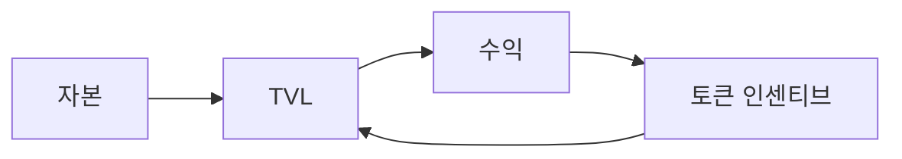
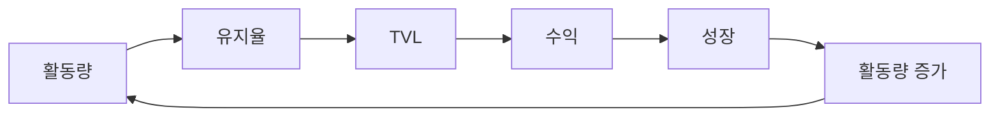

## 새로운 가치 플라이휠

전통적인 DeFi는 금융을 영원히 바꿔놓았습니다. 대출을 개방했습니다. 유동성에 대한 접근성을 높였습니다. 그리고 금융 상품을 누구나 이용할 수 있게 했습니다.

AAVE와 같은 프로토콜은 새로운 금융 시대의 토대를 마련했습니다. RocX는 이 토대 위에 구축되었습니다.

하지만 우리는 차세대 금융이 더 많은 것을 요구한다고 믿습니다.

전통적인 DeFi는 자본 최적화에 중점을 둡니다. RocX는 참여 최적화에 중점을 둡니다. 이 차이가 모든 것을 바꿉니다.

전통적인 DeFi는 다음 요소에 집중합니다. RocX는 다음을 통해 이 모델을 확장합니다.

| 전통적인 DeFi가 집중하는 것 | RocX가 더하는 것 |
| --- | --- |
| 예금 | 활동 |
| 차입 | 적극적인 에너지 |
| 유동성 | 평판 |
| 수익률 | 정체성 |
| — | 장기적인 참여 |

### 전통적인 DeFi의 순환

전통적인 DeFi에서는 다음과 같이 흐릅니다. 자본 → TVL → 수익 → 토큰 인센티브 → TVL.

성장은 더 많은 유동성을 유치하는 데 달려 있습니다.

하지만 유동성은 이동합니다. 자본은 수익률을 따릅니다. 인센티브는 만료됩니다. 그리고 사용자들은 종종 떠납니다.

### RocX의 플라이휠

RocX에서는 다음과 같이 흐릅니다. 활동량 → 유지율 → TVL → 수익 → 성장 → 활동량 증가.

성장은 참여에서 시작됩니다. 참여는 활발한 에너지를 만들어냅니다. 활발한 에너지는 평판을 쌓습니다. 평판은 정체성을 강화합니다. 그리고 정체성은 사용자들이 더 오래 머물고 더 많이 참여하도록 장려합니다.

이것은 자기 강화적인 순환을 만들어냅니다.

플라이휠은 사용자들이 보상을 쫓기 때문이 아니라, 역사를 만들어가기 때문에 성장합니다. 자본이 유입되기 때문이 아니라, 사람들이 머물기 때문에 성장합니다.

전통적인 DeFi는 금융의 자유를 만들어냈습니다. RocX는 금융의 소속감을 만들어내는 것을 목표로 합니다.

<Note>
왜냐하면 금융의 미래는 사용자들이 무엇을 소유하는지에 관한 것이 아니라, 사용자들이 무엇이 되는지에 관한 것이기 때문입니다.
</Note>
