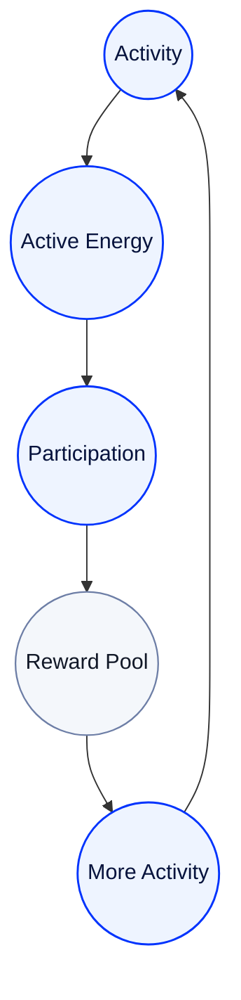

# Active Energy Economy

## A Sustainable Economy Built on Activity

Active Energy does not end when it is earned.

It is created, accumulated, used, and connected back into the ecosystem.

RocX designed Active Energy so activity can support a sustainable economy.

<Info>
Activity creates energy.  
Energy keeps the ecosystem moving.
</Info>

---

## Active Energy circulates.

Active Energy is not a one-time reward.

It is continuously created through user activity and keeps circulating inside the ecosystem.

Because it circulates, long-term participation can create greater value.

---

## A sustainable structure

RocX is designed so the ecosystem can grow as activity grows.

A portion of Active Energy created from exploration missions returns to the ecosystem.

Some is permanently removed to help maintain balance, and some returns to the Reward Pool to support new activity for the next participants.

The principle matters more than the numbers.

---

## Activity creates more activity.

Active Energy encourages more participation.

More participation leads to more activity.

This circular structure is designed so users and the ecosystem can grow together.

---

## The economy grows on participation.

RocX is building an economy that grows not only through capital, but also through participation.

Active Energy is the shared unit of value that connects users and the ecosystem at the center of that economy.

---

---

<Info>
A healthy economy  
is built on  
continuous participation.
</Info>

**Active Energy keeps the RocX ecosystem alive.**
