```mermaid
flowchart LR
  A((1<br/>Use DeFi Planet)) --> B[Deposit<br/>Lending<br/>Financial Activity]
  B --> C[[Active Energy<br/>Accumulates]]

  C --> D((2<br/>Join Proof of Activity Planet))
  D --> E[Verify meaningful<br/>Web3 activities]
  E --> F[[Receive<br/>AE Boost]]

  F --> G((3<br/>Participate in<br/>Explore Planet))
  G --> H[Daily Proof of Activity<br/>Missions<br/>Campaigns]
  H --> I[[Additional<br/>Active Energy]]

  I --> J((4<br/>Grow Reputation))
  J --> K[Continuous<br/>participation]
  K --> L[[Long-term<br/>Trust]]

  L --> M((5<br/>Unlock Better<br/>DeFi Experience))
  M --> N[Higher Benefits<br/>Better Opportunities]
  N -.-> A

  classDef planet fill:#eef4ff,stroke:#0133FD,stroke-width:1.5px,color:#07133d;
  classDef action fill:#ffffff,stroke:#c9d4e8,stroke-width:1px,color:#111827;
  classDef value fill:#f4f7fb,stroke:#6d7ea6,stroke-width:1.2px,color:#111827;

  class A,D,G,J,M planet;
  class B,E,H,K,N action;
  class C,F,I,L value;
```

# From Activity to Opportunity

## From Activity to Opportunity

RocX connects every activity into one flow that leads toward financial value.

Users do more than complete actions. They build a better financial experience through continued participation.

---

---

## Every activity connects into one experience.

In RocX, financial activity, activity verification, and exploration do not live as separate paths.

The three planets connect into one user experience.

As users participate, they accumulate more Active Energy, build long-term Reputation, and receive more benefits in DeFi Planet.

<Info>
DeFi creates value.  
Proof of Activity strengthens it.  
Explore keeps it growing.
</Info>

---

<Tip>
One ecosystem.  
One activity layer.  
One financial experience.
</Tip>

**Every Web3 Activity Creates Value.**