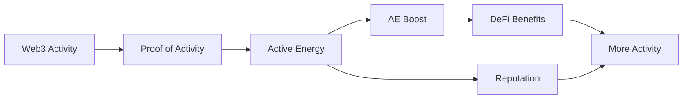

# Activity to Benefit Flow

Activity to Benefit Flow shows how RocX works. User activity moves through verification, AE, and boosts into DeFi Planet benefits and Reputation.

## Full Flow

## Web3 Activity

The flow starts with meaningful Web3 activity. DeFi activity, verification, missions, and community participation can all become verifiable signals.

## Proof of Activity

Proof of Activity checks and organizes activity into reliable signals. At this point, activity becomes usable inside RocX.

## Active Energy and AE Boost

Verified activity becomes Active Energy and can be strengthened through AE Boost. Boosts are connection points designed to improve DeFi Planet benefits.

## DeFi Benefits and Reputation

Users can receive better conditions and opportunities in DeFi Planet. At the same time, activity and AE accumulate into Reputation.