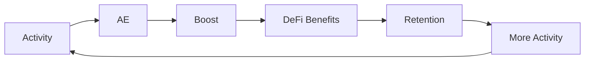

# Value Flywheel

The Value Flywheel describes the RocX growth loop. Activity becomes AE and benefits, and those benefits encourage continued activity.

## The Loop

## Activity to AE

Meaningful activity becomes AE through Proof of Activity. This turns activity into a value unit RocX can use.

## AE to DeFi Benefits

AE and Boost strengthen conditions and benefits in DeFi Planet. Users can see their activity affect financial experience.

## Retention and More Activity

Better benefits can support retention. Continued participation creates more activity and richer trust records.

## RocX Growth Direction

RocX uses this flywheel to align users, communities, and DeFi Planet. The core idea is that activity should flow back into financial value.