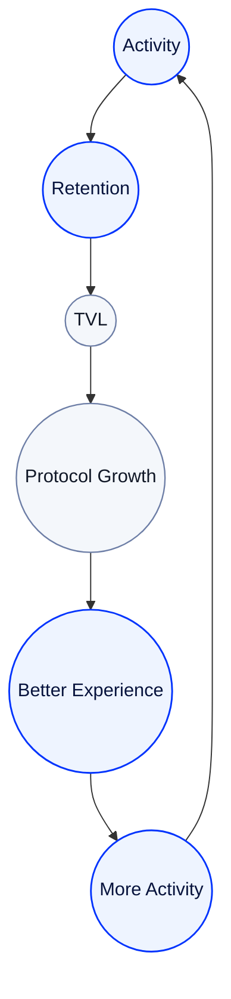

# Value Flywheel

## Growth That Reinforces Itself

RocX does not become stronger only because more users arrive.

It becomes stronger when users keep participating for longer.

<Info>
Sustainable growth  
comes from participation,  
not temporary incentives.
</Info>

---

---

## Activity creates retention.

Continuous activity helps users stay with the platform longer.

RocX treats retention as one of the most important growth metrics.

---

## Retention strengthens TVL.

As users continue to stay on the platform, financial activity can grow with them.

As a result, TVL grows from sustained participation rather than temporary inflow.

---

## Growth creates a better experience.

More activity and a stronger ecosystem can create better products, more partners, and more opportunities.

That experience leads back into more activity.

---

## Growth repeats.

RocX does not grow from a single event.

Continuous user participation grows the ecosystem, and a stronger ecosystem creates more participation again.

---

<Info>
Activity builds retention.  
Retention strengthens the ecosystem.  
The ecosystem creates more activity.
</Info>

**Growth begins with participation.**
