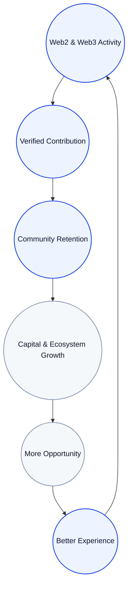

## Growth That Reinforces Itself

RocX does not become stronger only because more capital or users arrive.

It becomes stronger when onchain capital activity and verified contribution create reasons for users to keep participating.

The result is an activity-centered blockchain community where retention grows through recognition, reputation, useful experiences, and new opportunity rather than temporary incentives alone.

<Info>
Sustainable growth  
comes from participation,  
not temporary incentives.
</Info>

---

```mermaid
flowchart TB
  A((Web2 & Web3 Activity)) --> B((Verified Contribution))
  B --> C((Community Retention))
  C --> D((Capital & Ecosystem Growth))
  D --> E((More Opportunity))
  E --> F((Better Experience))
  F --> A

  classDef flywheel fill:#eef4ff,stroke:#0133FD,stroke-width:1.5px,color:#07133d;
  classDef growth fill:#f4f7fb,stroke:#6d7ea6,stroke-width:1.2px,color:#111827;

  class A,B,C,F flywheel;
  class D,E growth;
```

---

## Verified activity creates community retention.

Users may begin through wallets, protocols, native Web3 environments, or familiar Web2 platforms. When supported contribution is verified and connected to Reputation, Activity Identity, Active Energy, and ecosystem experiences, users gain reasons to return and participate again.

RocX treats retention not only as time spent on a platform, but as repeated meaningful participation in a growing blockchain community.

---

## Retention strengthens community and capital.

Returning contributors deepen ecosystem knowledge, contributor recognition, partner discovery, and financial participation.

TVL and protocol activity can grow alongside sustained community participation rather than temporary inflow alone.

---

## A connected community creates new opportunities.

More valid activity and a stronger Activity Graph can create better products, contributor recognition, partners, and opportunities.

These opportunities can connect users and creators from familiar Web2 platforms with Web3 ecosystems without requiring RocX to replace the original platforms.

---

## Growth returns to participation.

RocX does not grow from a single event.

Continuous user participation grows the ecosystem, and a stronger ecosystem creates more participation again.

---

<Info>
Activity builds community.

Community strengthens retention.

Retention expands opportunity.

Opportunity creates more activity.
</Info>

**Growth begins with participation.**
