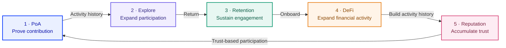

RocX is a **Proof of Activity-powered DeFi platform** that combines onchain capital activity with verified user participation.

RocX brings capital, contribution, and reputation into one measurable value system. Capital shows the foundation of financial activity, verified contribution reveals the value a user adds to Web3, and Reputation records its quality and consistency over time.

Within this system, users, contributors, builders, and partners can move beyond one-off reactions or rewards and expand trust and opportunity through a growing record of activity and contribution.

RocX is building an **activity-centered blockchain ecosystem** where participation does not disappear as an isolated event, but carries forward into future activity and collaboration.

<Info>
Capital shows a user's financial activity.

Contribution shows what users add to Web3.

Reputation records trust and consistency over time.
</Info>

---

## The participation loop that strengthens DeFi

RocX's three Planets form a single growth loop. **PoA proves contribution, Explore creates reasons to return, and the resulting retention expands the foundation for DeFi activity. The verified contribution and consistency built through this process ultimately strengthen Reputation.**

<Note>
Reputation is not an automatically granted reward; it is a record built from eligible signals such as verified contribution and consistency.
</Note>

---

## Connecting Web2 reach to Web3 growth through PoA

Many potential Web3 users already create content, discover information, and participate in communities on Web2 platforms. Instead of forcing them into an entirely new mode of activity, RocX uses PoA to verify meaningful activity created on existing platforms and turn it into a contribution history that can carry into Web3.

When verified activity connects to Reputation, Activity Identity, and participation opportunities, one-time acquisition can become a cumulative user experience. Users gain a reason to return as their contribution is recorded and reflected in future activity, while stronger retention can support a continuing cycle of content, evaluation, discovery, and community expansion.

This sustained participation creates more touchpoints through which new Web2 users can discover RocX and gives contribution-first users a gradual path toward onchain finance and DeFi Planet. RocX aims to build a growth structure in which **Web2 user acquisition and retention, further Web2 expansion, and the onboarding of new DeFi users reinforce one another**.

<Info>
**Web2 discovery → PoA verification → accumulated contribution history → continued participation and retention → new Web2 user expansion → DeFi onboarding**

Reputation, participation opportunities, and DeFi experiences at each stage remain subject to separate eligibility requirements and operating policies.
</Info>

---

## Three Planets, three responsibilities

<CardGroup cols={3}>
  <Card title="DeFi Planet" icon="coins" href="./defi-planet-overview">
    The **Capital Layer** for Deposit, Borrow, Swap, Bridge, and other supported onchain financial activity.
  </Card>
  <Card title="PoA Planet" icon="fingerprint" href="./poa-planet-overview">
    The **Participation and Contribution Layer** for registering, verifying, and evaluating meaningful activity.
  </Card>
  <Card title="Explore Planet" icon="compass" href="./explore-planet-overview">
    The **Engagement Layer** where Active Energy can support discovery and continued participation.
  </Card>
</CardGroup>

<Tip>
DeFi Planet measures capital. PoA Planet measures contribution. Explore Planet keeps participation moving.
</Tip>

---

## How external contribution becomes a value signal

<Steps>
  <Step title="Create contribution on an external platform">
    Users create Web3 research, education, analysis, development, tutorials, feedback, and other supported content on external platforms.
  </Step>
  <Step title="Register the original URL">
    Users submit only the original activity link from a connected account instead of re-uploading the content to RocX.
  </Step>
  <Step title="Verify the contributor and activity">
    RocX may review the source, contributor ownership, uniqueness, Web3 relevance, accessibility, and policy compliance.
  </Step>
  <Step title="Receive eligible community evaluation">
    Users who meet the operating requirements can evaluate the activity's informational, educational, or practical value as Helpful or Not Helpful.
  </Step>
  <Step title="Record contribution value">
    Eligible results may, after applicable operating-policy and abuse review, become signals for Contribution Score, AE distribution eligibility, Reputation, and Activity Identity.
  </Step>
</Steps>

<Note>
RocX does not replace the platforms where content is created or build another social network. It provides the layer that verifies and evaluates external activity and makes its value visible.

Activity registration and community evaluation are subject to current operating policy, including eligible DeFi deposit requirements. Registration or verification alone does not guarantee AE or Reputation.
</Note>

---

## Cross-platform contribution

Web3 contribution often appears on external platforms before it reaches RocX. Users can register the original URL of supported research, tutorials, analysis, development, education, feedback, and community content.

The content remains on the platform where it was created. RocX does not ask users to author or upload the title, body, image, video, attachment, or thumbnail inside PoA Planet. Available source metadata may be retrieved from the original platform where supported and appropriate.

<CardGroup cols={2}>
  <Card title="Cross-Platform Proof of Activity" icon="link" href="./cross-platform-proof-of-activity">
    See how external Web3 contribution enters the RocX value system.
  </Card>
  <Card title="Registration & Verification" icon="shield-check" href="./activity-registration-and-verification">
    Review source, contributor, uniqueness, relevance, validity, and abuse checks.
  </Card>
  <Card title="Evaluation & Contribution Score" icon="scale-balanced" href="./community-evaluation-and-contribution-score">
    Understand Helpful, Not Helpful, eligible evaluation, and multi-signal assessment.
  </Card>
  <Card title="PoA Activity Board" icon="table-list" href="./poa-activity-board">
    Explore the product surface for registering and discovering verified contribution.
  </Card>
</CardGroup>

---

## One activity layer, several outcomes

DeFi is RocX's core financial layer, but it is not the only destination of PoA value.

Qualified activity can connect to Active Energy, Reputation, Activity Identity, Contributor Recognition, partner opportunities, Explore participation, ecosystem access, and better DeFi experiences. These outcomes follow separate eligibility and operating rules.

<CardGroup cols={3}>
  <Card title="Active Energy" icon="zap" href="./active-energy">
    A non-transferable offchain ecosystem resource used for activity and participation.
  </Card>
  <Card title="Reputation" icon="badge-check" href="./reputation-layer">
    A non-transferable record of long-term quality, trust, consistency, and contribution history.
  </Card>
  <Card title="Activity Identity" icon="id-card" href="./activity-identity">
    A pseudonymous, privacy-aware record connecting capital activity, verified contribution, eligible evaluation, consistency, and Reputation.
  </Card>
</CardGroup>

<Warning>
Registration does not guarantee verification. Verification does not guarantee Active Energy, Reputation, ranking, payment, token distribution, or financial return.
</Warning>
