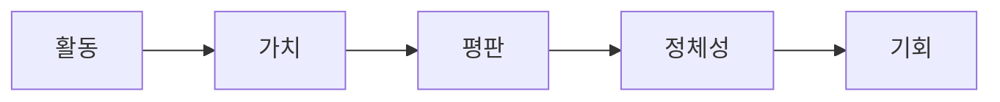

## 단순한 프로토콜 그 이상

RocX는 TVL(총 예치 자산) 극대화를 위해 만들어진 것이 아닙니다. 오히려 참여 극대화를 위해 만들어졌습니다.

수년간 DeFi는 유동성에 집중해 왔습니다. 프로토콜들은 더 많은 자본을 유치하기 위해 경쟁합니다. 사용자들은 하나의 기회를 찾아 헤맵니다. 이러한 순환은 성장을 가져왔지만, 지속적인 관계는 만들어내지 못했습니다.

RocX는 금융이 더욱 인간적이어야 한다고 믿습니다. 사람들은 단순히 유동성 공급자가 아닙니다. 그들은 탐험가이자, 기여자이며, 건설자이자, 생존자입니다. 그들은 참여하고, 가치를 창출하며, 시간이 지남에 따라 신뢰를 쌓아갑니다.

이것이 바로 RocX가 단순한 프로토콜 그 이상인 이유입니다.

RocX는 다음과 같은 생태계입니다. 활동이 가치가 되고, 가치가 평판을 쌓고, 평판이 정체성을 만들고, 정체성이 기회를 열어줍니다. 이것이 새로운 가치 선순환을 만들어냅니다.

투기가 아닌, 참여를 통해 움직이는 시스템.

단기적인 이익이 아닌, 장기적인 참여를 통해 움직이는 시스템.

가치를 추출하는 것이 아닌, 창조하는 시스템.

RocX는 DeFi를 대체하려는 것이 아닙니다. 오히려 DeFi 위에 새로운 레이어를 구축하고 있습니다.

지속적인 참여가 중요한 금융 시스템. 참여가 중요한 금융 시스템. 신뢰가 중요한 금융 시스템.

왜냐하면 우리는 금융의 미래는 탐구하고, 기여하고, 함께하는 사람들의 것이라고 믿기 때문입니다.

<Note>
함께하는 사람들을 위해. 그것이 바로 RocX입니다.
</Note>
